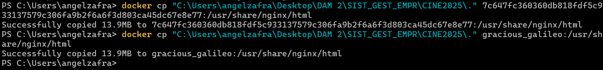
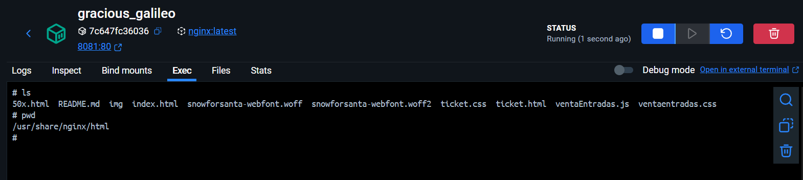

# 🖥️ Como subir nuestro repositorio a nuestro contenedor nginx

Para poder subir nuestros documentos a Docker, lo primero que tendremos que hacer es saber el comando a utilizar, en nuestro caso;

```bash
docker cp "C:\Users\angelzafra\Desktop\DAM 2\SIST_GEST_EMPR\CINE2025\." gracious_galileo:/usr/share/nginx/html
```
Siendo la primera ruta desde donde copia los archivos y la segunda hacia donde los copia.

### (gracious_galileo es el nombre de mi contenedor, pero tambíen podriamos poner su ID).



---
# ⬇️ Archivo dentro de nuestro contenedor Docker

En nuestro contenedor docker, en la ruta `/usr/share/nginx/html` tendremos nuestros archivos copiados de una, ahora, borramos el archivo index.html si no lo vamos a utilizar, en este caso, el que viene por defecto con;

`rm index.html`

O le cambiamos el nombre con;

`mv index.html indexViejo.html`

Ahora una vez hecho esto, en mi caso he modificado el nombre de mi fichero principal que era `ventaentradas.html` a `index.html`



---
# 👀 Como quedaría nuestra página web

Una vez realizado todos los pasos, podemos observar que la página web nada mas cargar quedaría así;

